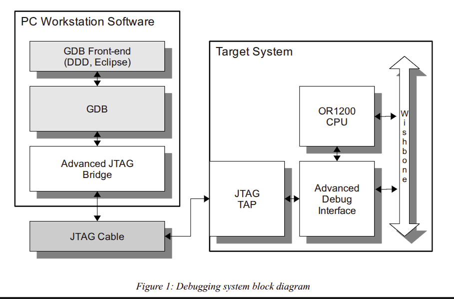

# Work Done

### JTAG chains vs DBG chains

chains defined in `abdg_defines.v` (or1200 adv_debug_sys src) or `or1k_du_adv.c` (openOCD src) are DEBUG chains
chains internal to the debug system of the or1200
not to be confused for JTAG chains (BYPASS, DEBUG, IDCODE) implemented by data registers.

`abdg_defines.v` or1200 verilog source code
```verilog
// Length of the MODULE ID register
`define	DBG_TOP_MODULE_ID_LENGTH	2

// How many modules can be supported by the module id length
`define     DBG_TOP_MAX_MODULES           4

// Chains
`define DBG_TOP_WISHBONE_DEBUG_MODULE  2'h0
`define DBG_TOP_CPU0_DEBUG_MODULE      2'h1
`define DBG_TOP_CPU1_DEBUG_MODULE      2'h2
`define DBG_TOP_JSP_DEBUG_MODULE       2'h3

// Length of data
`define DBG_TOP_MODULE_DATA_LEN  53
```

`or1k_du_adv.c` from openOCD source code
```c
#define DBG_MODULE_SELECT_REG_SIZE	2
#define DBG_MAX_MODULES			4

#define DC_NONE				-1
#define DC_WISHBONE			0
#define DC_CPU0				1
#define DC_CPU1				2
#define DC_JSP				3
```

### 

possible confusion around the word - `debug unit` - what module of debug unit are we talking about? 



| component | ref | description |
|-----------|-----|-------------|
| debug interface | `adv_debug_if.v` | interface between JTAG and cpu0/cpu1/wb debug units. "high level debug unit" |
| cpu debug unit | `or1200_du.v` | cpu debug unit, tells it to stall, register file content... | 
| wb debug unit | `adgb_wb_module.v` | cpu debug unit, tells it to stall, register file content... | 
| debug unit/controler | - | ambigous term for CPU debug unit or debug interface |

### making sure openOCD finds the JTAG interface

even if the JTAG interface is not connected to any debug interface how to make sure the JTAG interface is found by openOCD?
by opening the openOCD server with `openocd -f config.cfg` (openOCD config file provided by antoine's work) the openOCD server indicates
```bash
Info : JTAG tap: ecp5.tap tap/device found: 0x41113043 (mfg: 0x021 (Lattice Semi.), part: 0x1113, ver: 0x4)
```

JTAG has a minimum of three states: `BYPASS` `IDCODE` AND `DEBUG` (as well as ECR and ECR2 for JTAGG, custom JTAG chains). when using openOCD through telnet, the by-default/idle selected chain is always `BYPASS`

### lattice5 openOCD config

```bash
jules@jules-ubuntu:~/git/realtime_debugging_gecko5education$ cat /opt/oss-cad-suite/share/openocd/scripts/fpga/lattice_ecp5.cfg 
# SPDX-License-Identifier: GPL-2.0-or-later

if { [info exists CHIPNAME] } {
        set _CHIPNAME $_CHIPNAME
} else {
        set _CHIPNAME ecp5
}

# Lattice ECP5 family
# TAP IDs are extracted from BSDL files found on this page:
# https://www.latticesemi.com/Products/FPGAandCPLD/ECP5
#
# 0x01111043 - LAE5UM_25F/LFE5UM_25F
# 0x01112043 - LAE5UM_45F/LFE5UM_45F
# 0x01113043 - LAE5UM_85F/LFE5UM_85
# 0x21111043 - LFE5U_12F
# 0x41111043 - LFE5U_25F
# 0x41112043 - LFE5U_45F
# 0x41113043 - LFE5U_85F
# 0x81111043 - LFE5UM5G-25
# 0x81112043 - LFE5UM5G-45
# 0x81113043 - LFE5UM5G-85

jtag newtap $_CHIPNAME tap -irlen 8 -irmask 0x83 -ircapture 0x1 \
        -expected-id 0x01111043 -expected-id 0x01112043 -expected-id 0x01113043 \
        -expected-id 0x21111043 -expected-id 0x41111043 -expected-id 0x41112043 \
        -expected-id 0x41113043 -expected-id 0x81111043 -expected-id 0x81112043 \
        -expected-id 0x81113043

pld create $_CHIPNAME.pld lattice -chain-position $_CHIPNAME.tap
```

### JTAG instruction IRLEN and OPCODEs

- openOCD config file indicates IDCODE is `LFE5U_85F`.
- lattice ECP5 correspondance = `LFE5U_85F`
- goto website and get BSDL file of `LFE5U`
- filter out all files with are not `_85F`

```
-- Instruction register description
	attribute INSTRUCTION_LENGTH of LFE5U_85F_XXBG381 : entity is 8; // <<<==== this is -irlen !
	attribute INSTRUCTION_OPCODE of LFE5U_85F_XXBG381 : entity is
		"              IDCODE		(11100000)," &
		"          ISC_ENABLE		(11000110)," &
		"    ISC_PROGRAM_DONE		(01011110)," &
		" LSC_PROGRAM_SECPLUS		(11001111)," &
		"ISC_PROGRAM_USERCODE		(11000010)," &
		"ISC_PROGRAM_SECURITY		(11001110)," &
		"         ISC_PROGRAM		(01100111)," &
		"        LSC_ENABLE_X		(01110100)," &
		"              BYPASS		(11111111)," &
		"      ISC_DATA_SHIFT		(00001010)," &
		"       ISC_DISCHARGE		(00010100)," &
		"            USERCODE		(11000000)," &
		"      ISC_ERASE_DONE		(00100100)," &
		"               CLAMP		(01111000)," &
		"   ISC_ADDRESS_SHIFT		(01000010)," &
		"             PRELOAD		(00011100)," &
		"            ISC_READ		(10000000)," &
		"         ISC_DISABLE		(00100110)," &
		"           ISC_ERASE		(00001110)," &
		"            ISC_NOOP		(00110000)," &
		"              SAMPLE		(00011100)," &
		"               HIGHZ		(00011000)," &
		"              EXTEST		(00010101)," &
```

can notably see JTAG chains used to reconfigure the FPGA when using _openFPGALoader_ to upload hardware src to VP

#### Get IDCODE of device using openOCD

Connect to openOCD server using telnet.
hex code of `0b11100000` is `0xE0`
```bash
> irscan ecp5.tap 0xE0
> drscan ecp5.tap 32 0
41113043
```

