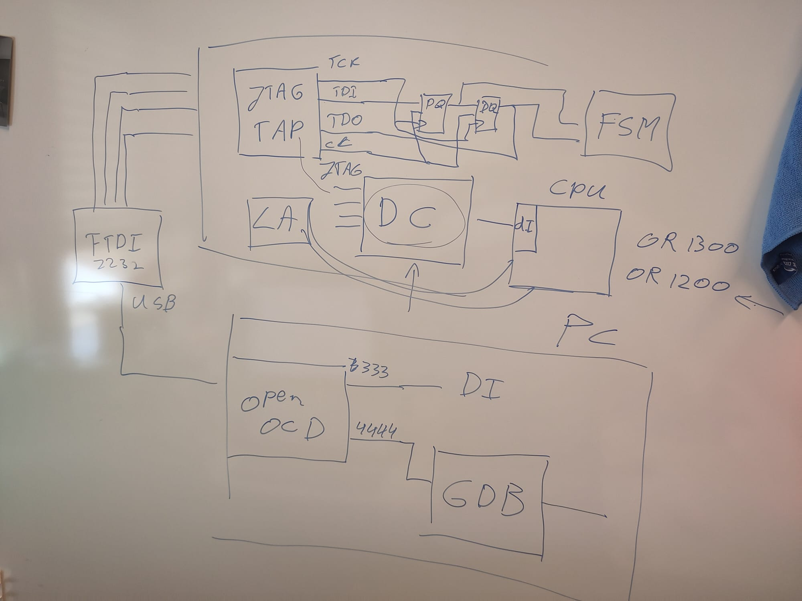
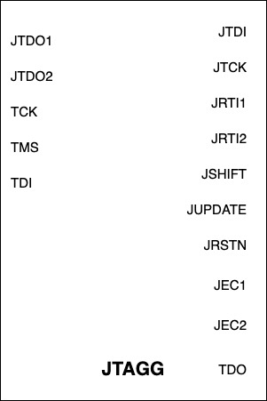
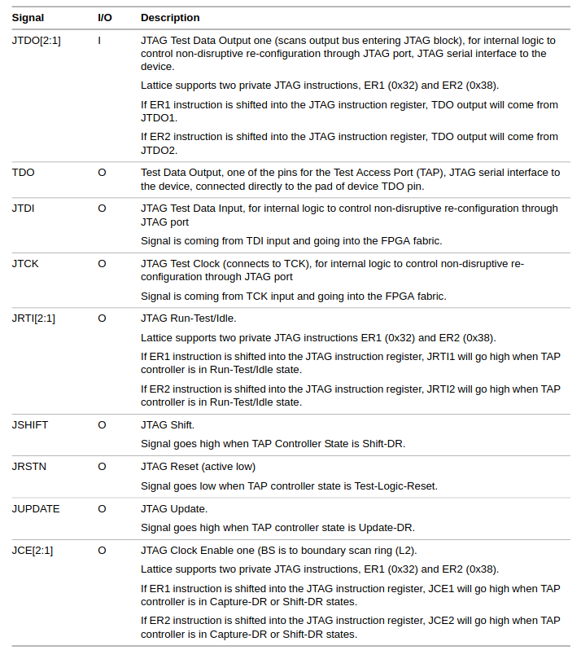

# Meeting Notes

## General semester project info

- Remind to ask about last semester project of last student
- Midterm presentation, email about that
- Final presentation, week before exam in JANUARY. Needs to be everything of work. Repeat everything in midterm if needed. Not incremental 
- Report 1 week before final persentaton
- Maybe one meeting every 2 weeks
- Incrementally build documentation for project

## Notes

Joined Test Action Group = hardware component inside FPGA. 4 wires, serial protocol
Jtag is hardware component. Already implemented in the FPGA.
Four wires. TCI TCK TDO CC then two registers then FSM
~~Openrisc.io DEBUGGING WITH OPENOCD AND GDB~~
Or1200 processors already have a debug interface. Maybe look into that ( DEBUG CONTROLLER ) and take inspiration from that 

In the long term, think about:

- Look for information to simulate the jtag interface on software for openOCD. Looking for software simulation ( if exists) OF JTAG INTERFACE. maybe look in the openocd documentation. Maybe simulator exists for OR1200 and signals would be somewhat similar, basically a VP coded in C
- When diving in openOCD, whats the difference with RISC because in the future the VP will be a RISC5 virtual prototype

# Work done

## JTAG interface, TAP controller, JTAGG

JTAG is the name of the communication protocol. Defines four signals (TDI, TDO, TCK, TMS) + one optimal reset signal.

| Signal | Name | Description |
|--------|------|-------------|
| TDI    | Test data in | Data coming from the PC, written to either DR or IR depending on state of controler FSM |
| TDO    | Test data out | Data coming out of the DR, to the PC
| TCK    | CLock signal |
| TMS    | TEst mode select | One bit coming from the PC, used to navigate through the TAP controler FSM |

JTAG is only the interface but the corresponding hardware component is the TAP controler. The TAP controler is described as a finite state machine with 16 states, and the 1-bit signal TMS is used to change its state.

The TAP controler has two types of registers. The first is the **instruction register IR** and the second are **data registers DRs**.

The JTAG standard does not provide a fixed size for IR or DR registers as:
- the size of the IR depends on the chip architecture and the number of JTAG instructions that the chip will be using. The JTAG standard allows IR's of any size.
- the size of DRs also depend on the chip architecture. For reading content of physical CPU registers, the DR needs to be the size of the CPU physical registers. For reading GPIO stuff it might not need 64 bits.

The instruction register contains the currently active JTAG instruction. It may or may not be associated to a one, or multiple, data registers. Typically there is one DR per instruction (BYPASS, IDCODE, DEBUG), but some instructions have no DR associated (RESET), and some rare instructions use multiple DRs. 

Only one DR can be active at a time, this is determined by the content of the IR.

## Structure of FSM

The FSM has two big "cycles", DR and IR. The IR cycle is used to read and write to the IR register i.e select a new JTAG instruction to perform, while the DR cycle is used to read and write the content of the DR selected by the IR.

Typically, the PC first goes through the IR cycle to write an instruction, and then enters the DR cycle (after fully exiting the IR cycle) to read the value associated to that instruction.

TODO Capture-IR, Exit1, Exit2, Pause not really important. extra subtle protocol for edge cases. most important concept is the shift registers.

## Example instructions

### Custom instruction: live reading one register from the CPU

Let's assume that the IR is 4 bits long and that the instruction corresponding to reading the CPU register is `0b0010`. Assume that the TAP controler FSM has been inactive for a long time so it is in the `test/run idle` state (waiting for TMS to turn on).

First the PC turns on TMS for two cycles, such that the FSM transitions to Select-DR, then Select-IR. TMS switches back to 0 for 2 cycle, transitioning to Capture-IR and then Shift-IR. The IR and DR registers are shift registers, so as long as the TAP controler stays in the Shift-IR state, one bit from the IR is read and sent through TDO, and the input bit provided in TDI overwrites the previous value. Since the IR is 4 bits long, the PC keeps TMS low during exactly 4 cycles, before switching TMS to high to exit the IR branch.

Second the PC turns on TMS for one cycle, then low for 2 cycles. This ensures it transitions to Shift-DR. Similarily, content of DR is written to TDO (one bit per cycle) and is overwritten by content from TDI. Here we assume that the CPU places the value of the physical register inside the DR of the JTAG interface.

### BYPASS instruction

BYPASS instruction is used when multiple chips are on the same TDI/TDO lines. One PC can be connected to multiple chips **in series**. Typically you can have only one chip in non-bypass, and the remaining in bypass so that they do not interpret the same instruction.

In BYPASS instruction, TDI is connected to TDO and DR is ignored.

### IDCODE

Key instruction of JTAGG. Generally 32bit data register containing the ID of the chip being tested/debugged. Version, revision, product number, vendor.

## JTAGG block

Our Lattice FPGA contains a chip that implements the JTAG standard. This chip is refered as JTAGG. Actually, it implements the four basic JTAG signals, plus extra.

The JTAGG implementation of the Lattice PFGA features two slots for custom JTAG instructions. Previous semester project used the first of these two slots to implement RGB LED control. The following document extracted from the Lattice FPGA documentation provides the JTAGG interface pin description.

_Actually, this is not the pin layout of the JTAGG interface but for the JTAGF interface, which is the JTAGG equivalent for another family of FPGAs. The docs do not provide any info on the JTAGG pin layout so we will have to assume they are the same_

These pins essentially allow the implementation of the two custom instruction slots presented above.

## JTAG for realtime debugging

Use one of the ER1/2 slots for interfacing a debug controler. Last year's semester provides an ipcore to deserialize information taken from the JTAGG block.

~~TODO find the debug controler of the OR1200 processor.~~

https://github.com/openrisc/or1200/blob/master/rtl/verilog/or1200_du.v

`adv_debug_sys` apparently is an additional interface needed for jtag in openrisc processors: https://github.com/olofk/adv_debug_sys/tree/master

## Is there a simulator for an OR processor that I can use to run 

`or1ksim is an instruction accurate simulator with a lot of features including flexible configuration and gdb debugging.`

https://github.com/openrisc/or1ksim

