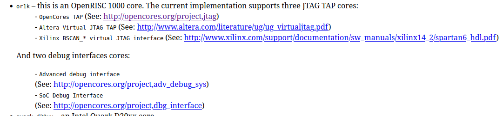

# Meeting notes

different wishbone implementations. find and download specs it online

find openocd docs where to tell openOCD to use the chain 0x32 on the debug controler
either one of the two user custom instructions 0x32 and 0x37
where to put that in openOCD config files???

worst case use telnet at the beginning for very basic scans as one can do irscans manually

once dummy debug controler is done, implement wishbone module first, as it is required to upload programs.
understand what the jsp server does (fourth and last module of adv_debug_if)

# Work Done

### Config used for openOCD

```c
jules@jules-ubuntu:~/git/realtime_debugging_gecko5education/JTAG_support_for_Gecko5Education/project/scripts$ ./debug.sh 
Open On-Chip Debugger 0.12.0+dev-00519-gb6ee13720-dirty (2025-09-17-02:11)
Licensed under GNU GPL v2
For bug reports, read
        http://openocd.org/doc/doxygen/bugs.html
jtag
Info : mohor tap selected
Info : adv debug unit selected
Info : Option 7 is passed to adv debug unit
Info : set servers polling period to 1ms
Info : clock speed 3000 kHz
Info : JTAG tap: or1420.cpu tap/device found: 0x41113043 (mfg: 0x021 (Lattice Semi.), part: 0x1113, ver: 0x4)
Info : adv debug unit is configured with option ADBG_USE_HISPEED
Info : adv debug unit is configured with option ENABLE_JSP_MULTI
Info : adv debug unit is configured with option ENABLE_JSP_SERVER
Info : Listening on port 7777 for jsp connections
Info : [or1420.cpu] Examination succeed
Info : starting gdb server for or1420.cpu on 3333
Info : Listening on port 3333 for gdb connections
Halting processor
Info : Halt timed out, wake up GDB.
Error: timed out while waiting for target halted
```
TIME OUT ON HALTING. unless CPU is halted, cannot start openOCD server.
need to either stall or at least ack the cpu stall (emulate acks)

there are many openOCD configs to stackup for openOCD to recognize the target cpu debug module

| config | used for |
|--------|----------|
| `interface_ftdi.cfg` | USB interface used |
| `generic_or1k.cfg` | generic config for debugging or1k through gdb |
| `target_or1k.cfg` | target config for  |
| `fpga_lattice_ecp5.cfg` | recognizes tap controler of lattice ecp5 |

### Only few TAPs supported by OpenOCD!!!

OpenOCD can communicate with any JTAG (virtual vjtag, mohor, anything...) BUT if we want to use OpenOCD for CPU debugging (which is necessary if we want to use GDB), there is only a few subsets of JTAG TAG cores that are actually supported:


`adv_debug_sys` is the one supported by openRISC atm though it used to support `mohor` which was another OpenCores open source debug interface.
```bash
# openOCD commands for selecting du core (mohor/adv)
du_select adv ....
du_select mohor ....
```

list of TAPs supported:
```
# openOCD command to select tap core
tap_select vjtag
tap_select mohor
tap_select xilinx_bscan
```

### Answer of last week's question

Last week's question was - where to inform openOCD what opcodes to use? using the `tap_select` as since the irlen is different, the protocols and opcodes used but also be different. this is done under the hood by the `tap_select` command
```
# Configure the target
if { [string compare $_TAP_TYPE "VJTAG"] == 0 } {
        if { [info exists FPGATAPID] } {
           set _FPGATAPID $FPGATAPID
        } else {
           puts "You need to set your FPGA JTAG ID"
                shutdown
        }

        jtag newtap $_CHIPNAME cpu -irlen 10 -expected-id $_FPGATAPID

        set _TARGETNAME $_CHIPNAME.cpu
        target create $_TARGETNAME or1k -endian $_ENDIAN -chain-position $_TARGETNAME

        # Select the TAP core we are using
        tap_select vjtag

} elseif { [string compare $_TAP_TYPE "XILINX_BSCAN"] == 0 } {

        if { [info exists FPGATAPID] } {
           set _FPGATAPID $FPGATAPID
        } else {
           puts "You need to set your FPGA JTAG ID"
                shutdown
        }

        jtag newtap $_CHIPNAME cpu -irlen 6 -expected-id $_FPGATAPID

        set _TARGETNAME $_CHIPNAME.cpu
        target create $_TARGETNAME or1k -endian $_ENDIAN -chain-position $_TARGETNAME

        # Select the TAP core we are using
        tap_select xilinx_bscan
} else {
        # OpenCores Mohor JTAG TAP ID
        set _CPUTAPID  0x14951185

        jtag newtap $_CHIPNAME cpu -irlen 4 -expected-id $_CPUTAPID

        set _TARGETNAME $_CHIPNAME.cpu
        target create $_TARGETNAME or1k -endian $_ENDIAN -chain-position $_TARGETNAME

        # Select the TAP core we are using
        tap_select mohor
}
```
all three supported TAPs have different irlen's indicating the opcodes are probably different

opcodes of MOHOR
```
attribute INSTRUCTION_OPCODE of OC_TAP : entity is
        "EXTEST            (0000)," &
        "SAMPLE_PRELOAD    (0001)," &
        "IDCODE            (0010)," &
        "MBIST             (1001)," &
        "DEBUG             (1000)," &
        "BYPASS            (1111),";
```

opcodes of VJTAG
```
TODO ?
```


### Solution for now

wrote a different driver fine tuned to lattice FPGA based on `mohor` tap. only difference as of right now is the OPCODE used to access the debug module.

JTAGG primitive not guaranteed to be compatible with the basic JTAG openOCD driver....... maybe timing problems (recall last year with the one click delay on TDI). must check this! THOUGH: it should work, because openOCD uses the same code for DR scans when its from telnet and when its from GDB

### try to select debug module!

right now the connections to the jtag interface work fine. I could write some basic code to perform DR scans and get the IDCODE!
```
Info : JTAG tap: or1k.cpu tap/device found: 0x41113043 (mfg: 0x021 (Lattice Semi.), part: 0x1113, ver: 0x4)
Info : ---------------
Info : moving gecko tap IR to IDCODE
Info : reading IDCODE from gecko tap dr
Info : read 0x41113043
Info : ---------------
```

if this works, 50% of the work is done, because it will confirm that the underlying adv_debug_if is resilient to the 1 cycle delay of the TDI line

