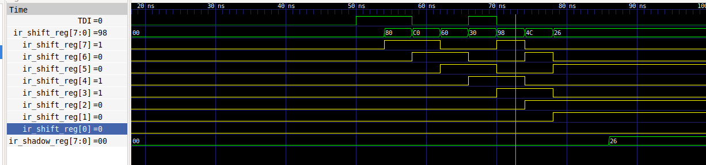

# Meeting Notes

use one of the two custom OPCODEs from JTAGG primitive, we will not be creating a different TAP controler for the CPU/emulating the JTAGG controler in verilog => need to interface JTAGG with adv_debug_if directly

# Work Done

## iverilog simulation

objective: first get a simulation working using the `JTAGG.v` verilog simulation provided by tom vebeure
after this, we can simulate the interface with `adv_debug_if`

### send raw jtag commands

Since we are testing the raw JTAGG primitive, we need to write verilog tasks and send RAW jtag commands bit-by-bit
objective: write tasks to send IR and DR scans
```verilog
task send_ir(input [7:0] ir_value);
task send_dr(input [63:0] dr_value, input integer dr_len);
```

then we can do an ir scan with IDCODE `0x38` using
```verilog
send_ir(8'h38);
```

Recall JTAG TAP FSM


simulations compiled using icarus verilog
```bash
iverilog -o testbench tb_select_module.v  \
   jtag_tap.v JTAGG.v \
   ../verilog/jtag_if.v ./../../adv_debug_if/verilog/*.v -I./../../adv_debug_if/verilog
echo "tb compiled"
./testbench
echo "tb ran"
```

using GTKWave to check simulation results.

Implemented those functions using ChatGPT. fixed the IR len to 8 and managed to get the right IDCODE to show up in the `ir_shadow_reg` of the JTAG TAP controler as seen below. recall custom IDCODEs are `0x32` and `0x38`.



### select adbg module

reverse engineering source code of openOCD method for selecting one of the debug controler modules:
```c
/* Selects one of the modules in the debug unit
 * (e.g. wishbone unit, CPU0, etc.)
 */
static int adbg_select_module(struct or1k_jtag *jtag_info, int chain)
{
	if (jtag_info->or1k_jtag_module_selected == chain)
		return ERROR_OK;

	/* MSB of the data out must be set to 1, indicating a module
	 * select command
	 */
	uint8_t data = chain | (1 << DBG_MODULE_SELECT_REG_SIZE);

	LOG_DEBUG("Select module: %s", chain_name[chain]);

	struct scan_field field;

	field.num_bits = (DBG_MODULE_SELECT_REG_SIZE + 1);
	field.out_value = &data;
	field.in_value = NULL;
	jtag_add_dr_scan(jtag_info->tap, 1, &field, TAP_IDLE);

	int retval = jtag_execute_queue();
	if (retval != ERROR_OK)
		return retval;

	jtag_info->or1k_jtag_module_selected = chain;

	return ERROR_OK;
}
```

```c
uint8_t data = chain | (1 << DBG_MODULE_SELECT_REG_SIZE);
```

argument `chain` is one of the following
```c
#define DC_WISHBONE			0
#define DC_CPU0				1
#define DC_CPU1				2
#define DC_JSP				3
```

the corresponding verilog code in the top level of the adbg controler, where `DBG_TOP_MODULE_DATA_LEN` is 53
```verilog
// Registers
reg [`DBG_TOP_MODULE_DATA_LEN-1:0] input_shift_reg;  // 1 bit sel/cmd, 4 bit opcode, 32 bit address, 16 bit length = 53 bits

//.............

///////////////////////////////////////
// Combinatorial assignments

assign select_cmd = input_shift_reg[52];
assign module_id_in = input_shift_reg[51:50];

//////////////////////////////////////////////////////////
// Module select register and select signals

always @ (posedge tck_i or posedge rst_i)
begin
  if (rst_i)
    module_id_reg <= 2'b0;
  else if(debug_select_i && select_cmd && update_dr_i && !select_inhibit)       // Chain select
    module_id_reg <= module_id_in;
end
```

to select wishbone module we can use a DR scan with a data of:
```c
uint8_t data = 0b100;
```

equivalent to raw JTAG bit-level command:
```verilog
send_dr(53'b100);
```

#### first problem

i set `debug_select_i` to `JRTI1` (high on run/time/idle when 0x32 is in IR) but `debug_select_i` needs to be 1 for as long as 0x32 is selected, not only in run/test/idle.......

why does JTAGG not provide references to ALL internal TAP signals?????????????????

fixed by implementing two new signals to properly interface signals provided by JTAGG. `SEL1` should be high for as long as `0x32` is found in IR. current implementation is rather weak but sufficient to perform DR scans. this implementation can be made accurate by using a register to remember the last index of JRTIx found.
```verilog
/*
* First interface problem:
* We need a signal high when 0x32 is loaded
* in IR. This is not exactly that but sufficient,
* most important is in SHIFT IR/DR.
*/ 
assign s_SEL1 = s_JRTI1 | s_JCE1;
```


second signal is `s_CAPTURE1`. this one is accurate, `JCE1` is high on capture/shift so by applying `&& !JSHIFT` we can filter out when the TAP is shifting. chatGPT pretends it is not a necessary transformation.. ?
```verilog
/*
* Second interface problem:
* JTAGG provides JCE1 (clock enable 1) which is
* high when TAP is either in CAPTURE or SHIFT and
* when 0x32 is in IR. we only need when CAPTURE is high,
* not shift.
*/
assign s_CAPTURE1 = s_JCE1 && !s_JSHIFT;
```

#### problem 1