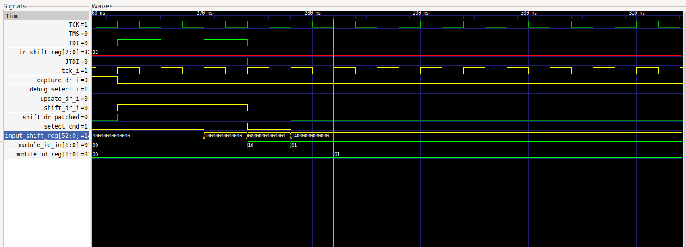

# Meeting Notes

way to fix 1 cycle delay. MSB needs to be ignored and use TDI for the LSB.

{  shiftreg[:-1] : TDI } instead of {  shiftreg[:] }


# Work Done

I noticed a small problem on last screenshot of last week's notes. the selected module ID is stored inside `module_id_reg` and `module_id_in` is only a temporary signal which extracts the module ID from the current value of the input shift register. the reason the module ID register is not being updated, is that it requires the `debug_select_i` signal to be ON while `update_ir` is high, which is not the case. JTAGG will not return a signal that is HIGH while IR contains ER1, so we need to change our implementation of `debug_select_i`

## Problem/ `debug_select_i` goes low

I said last week that `debug_select_i` was only needed when in shift/Capture state. not true
top level debug controler checks the signal when UPDATING module ID register after getting a module select command.

verilog code
```verilog
assign select_cmd = input_shift_reg[52];
assign module_id_in = input_shift_reg[51:50];

//////////////////////////////////////////////////////////
// Module select register and select signals

always @ (posedge tck_i or posedge rst_i)
begin
  if (rst_i)
    module_id_reg <= 2'b0;
  else if(debug_select_i && select_cmd && update_dr_i && !select_inhibit)       // Chain select
    module_id_reg <= module_id_in;
end
```

need to patch up that signal so that it stays on for as long as needed. no real solution as of right now because no access to the internal signals of the TAP controler. no way to detect when a change in the IR occurs.

solution for now: at the beginning openOCD chooses the DEBUG chain and keeps it active. **hypothesis for now that openOCD never leaves the DEBUG chain**. with that fix, the selected module ID now enters the `module_id_reg`

THIS WILL NEED A BETTER FIX once we start adding a second custom instruction to the JTAGG primitive.

## Problem/ TDI 1-cycle offset

solution proposed: intercept signal provided by input_shift_reg and provide `{  shiftreg[-1:0] : TDI }` instead of `shiftreg[:]`.

problem with this solution is that the debug controler does not have any shadow register, it only has the input shift reg. so the TDI value is not permanent and needs to be stored somewhere, in an extra register. it would be very convenient to force the input reg to shift once more instead of having to rely on an extra register.

solution used: always force the debug controler to shift one extra bit. this is easily done by remembering the last state of `shift_dr_i` and then OR-ing `shift_dr_i` with its last state. this makes sure that ALL DR scans always scan N+1 bits. the MSB bit, always set to 0, is properly overwritten and the LSB is replaced by the current value of TDI.

