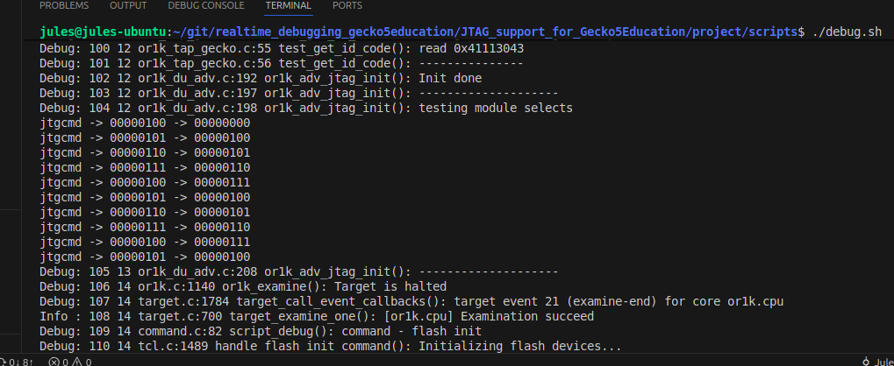

# Meeting Notes

clock input shift register on negative edge

- potential fix for wishbone interfacing => make an intermediary module that translates wishbone into system bus. emulate both bus in verilog basically
- GDB can be used to upload programs.
- see what commands GDB generates when uploading a program 
- and understand how openOCD translates a memory read into JTAG raw commands

would be nice to have programs uploadable for final report that way we can provide testbenches and compare JTAG speed to RS232 

# Work Done

## No need to increase drlen by 1

raw JTAG DR scans produced by openOCD now work fine without introducing a 1 cycle delay.

