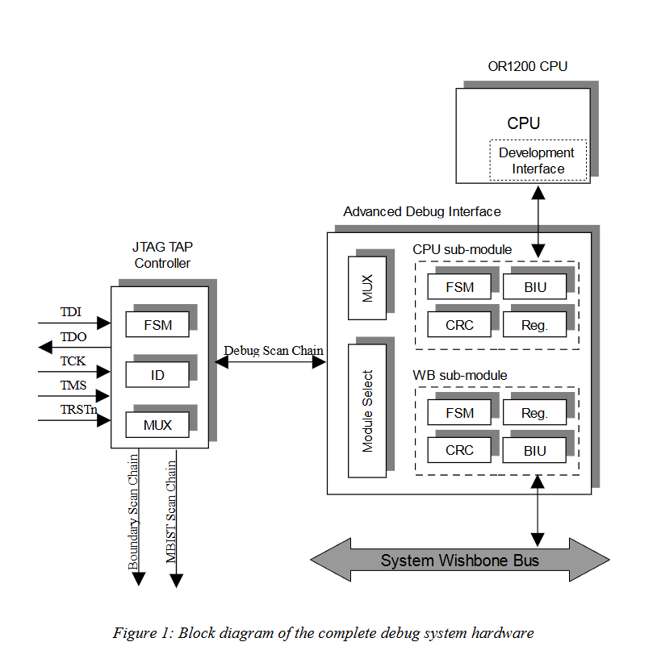
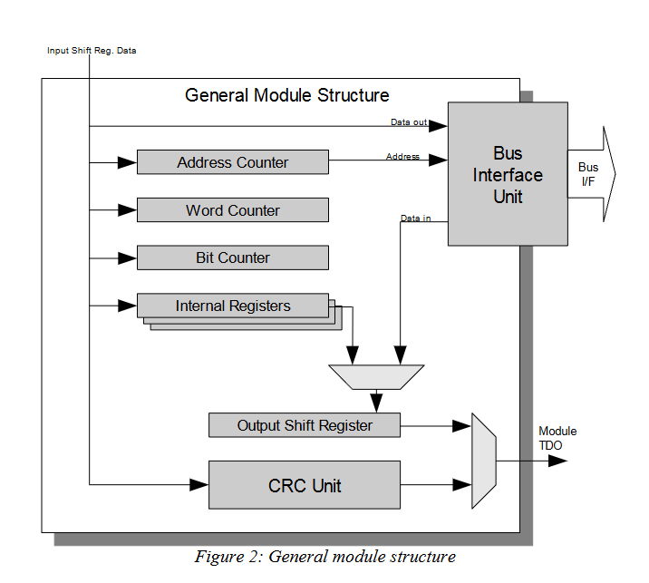
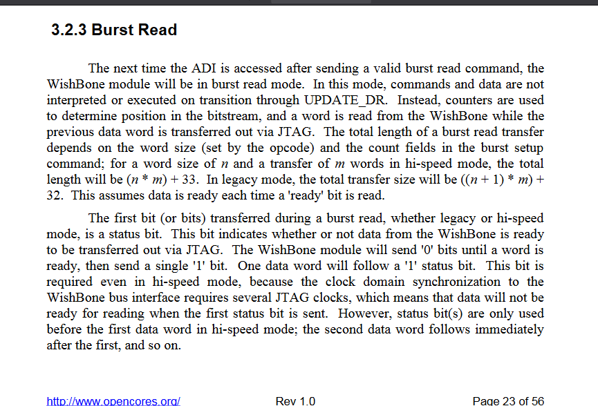

# Meeting Notes

No meeting before presentation

# Work Done

## Module selection

Got the RGB LED array to light up depending on the module selected. Two LEDs light up red to indicate binary ID of selected module
```verilog
assign red   = ~( {  8'b0, module_id_reg  });
assign green = ~(10'b0);
assign blue  = ~(10'b0);
```

For some reason this does not work properly. When selecting twice the same module, LED take a few select module commands to settle. Clock domain pb?
```verilog
assign red[9:4] = 6'b0;
assign red[3:0] = ~module_selects;
```

## Better view of full debug controller

ADI = advanced debug interface



## General module

One module = one BIU (bus interface unit) + internal registers + module logic (output shift reg, crc, word/bit counter....)
Wishbone and CPU modules are pretty similar.



Wishbone module
- BIU is for accessing the system bus.
- Wishbone module has ONE internal register
  33bits error registers = (one bit error ; 32bit address of error)

CPU submodule
- BIU is for accessing the SPR bus of the CPU.
- CPU submodule has ONE internal register.
  2bit status register = (stall ; reset).
  write to reset/stall to reset/stall CPU.

Can both read and write to internal registers.

## CPU submodule

Top level signals to provide to the or1k CPU submodule
```verilog
// JTAG signals
tck_i,
module_tdo_o,
tdi_i,

// TAP states
capture_dr_i,
shift_dr_i,
update_dr_i,

data_register_i,  // the data register is at top level, shared between all modules
module_select_i,
top_inhibit_o,
rst_i,

// Interfate to the OR1K debug unit
cpu_clk_i,
cpu_addr_o,
cpu_data_i,
cpu_data_o,
cpu_bp_i,
cpu_stall_o,
cpu_stb_o,
cpu_we_o,
cpu_ack_i,
cpu_rst_o
);
```

Interface signals with the CPU
```verilog
cpu_clk_i, // bus clock
cpu_addr_o, // address bus
cpu_data_i, // data bus input
cpu_data_o, // data bus output
cpu_stb_o, // bus strobe
cpu_we_o, // bus write enable
cpu_ack_i, // bus acknowledge

cpu_bp_i, // -- breakpoint
cpu_stall_o, // -- stall
cpu_rst_o // -- cpu reset
```

The bus is for the SPR bus access. SPR = special purpose registers // register file. The debug unit will access the CPU SPRs through this bus. The BIU of the CPU submodule is used to access the SPR bus.

Reading or writing registers is done by performing reads/writes to the SPR exactly like mem reads or writes are done with wishbone module.

OpenOCD can also perform internal register reads/writes. 

## Wishbone module

Bus interface signals do not have "beginTransaction" like on the VP. It is a wishbone initiator.... how to handle collisions in the system bus?

### Solution to explore

Use legacy mode and use status bit everytime a word is read from the bus???




