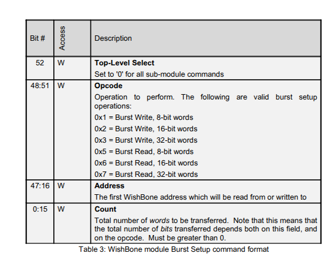
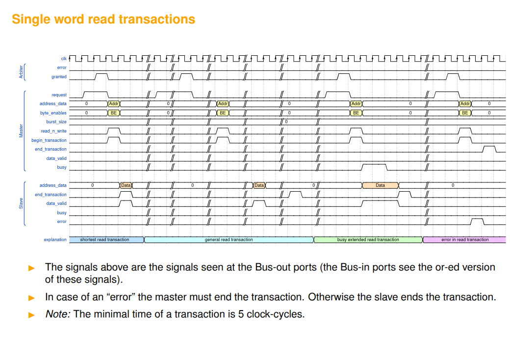
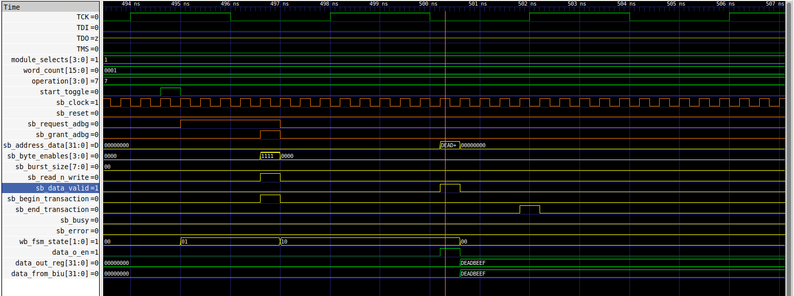

# Meeting Notes

avoid using such double assignments. this is not a problem when using VHDL but it is with verilog. sometimes verilog compiles it wrong and this screws up timings.
```verilog
a <= b;
a <= c;
```
better use
```verilog
if (....) a <= b;
else (...) a <= c;
```

would make sense to have only 1 word transactions on the biu.
jtag clock is much slower than the system bus

# Work Done

## single word read's for BIU

Yes, the BIU only performs single word wishbone transactions (both reads and writes)

```verilog
assign wb_cti_o = 3'h0; // no burst
assign wb_bte_o = 2'h0; // ignored because no burst
assign wb_cab_o = 1'b0; // address does not change during burst
```
it makes sense, because the system bus is much faster than the JTAG clock (almost 20 times faster).


## optimistic approach

if openOCD reads 32 bits, it needs 32 JTAG clocks.
JTAG ~ 4Mhz, system ~80Mhz so 20 times faster.
openOCD takes ~600 system cycles to transfer 32 bits through JTAG.

we assume that 600 system cycles is enough for the BIU FSM to ask access to the arbiter, read a word and write it to the 32bit buffer in between the BIU and the Wishbone submodule (`reg [31:0] data_out_reg` -> `wire [31:0] data_from_biu`).

if it is not enough, the debug interface will place a status bit set to `0` in front of the bits transfered and openOCD will try again later the same transfer.

### adapt BIU FSM





all signals previously starting with `wb_` for wishbone, i replaced by `sb_` for "system bus"

Need to add one extra state to ask for permission to write to bus. also need to increase the number of bits required to store the state.
```verilog
reg [1:0] wb_fsm_state;
reg [1:0] next_fsm_state;

`define STATE_IDLE     2'd0 // Ready
`define STATE_REQUEST  2'd1 // Waiting for bus access
`define STATE_TRANSFER 2'd2 // Performing transfer
```

in state `STATE_REQUEST` the request signal is asserted and the FSM waits for the bus arbiter to assert the `grant` signal for bus access.



later I need to latch the signals from the bus to avoid long critical paths in between the bus OR'd signals and the BIU. right now there are combinatorial paths between the bus signals and the block with decides the FSM state and outputs.

> question: weirdly the source code of adv_debug_sys does have these combinatorial paths, isn't this bad for performance and synthesis?

single word reads so burst size is always 0.
```verilog
assign sb_burst_size_o = 0; // 0 = 1 word burst
```

later, I need to make this compatible with memory writes. in case of writes, the master must end the transaction. in case of reads, the slave ends successful transactions, in case of errors then the master should end the transaction.

```verilog

```

also need to provide support for the `sb_busy_in` signal in case of write.