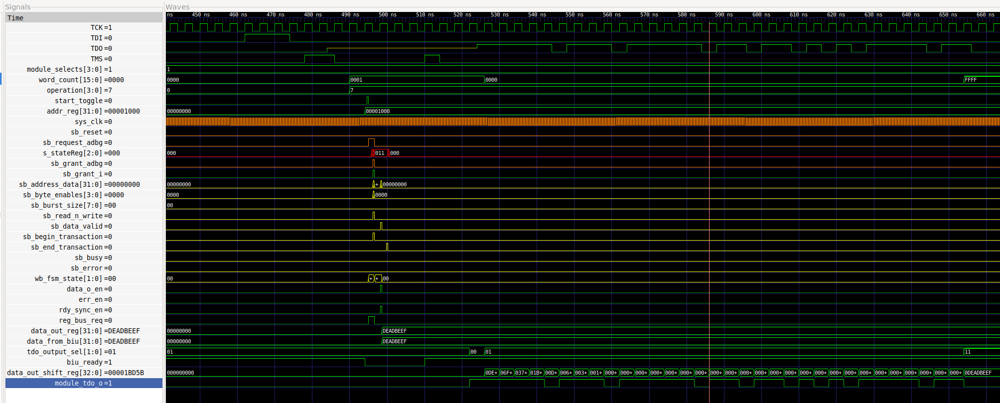

# Meeting Notes

No meeting

# Work Done

## added bus arbiter to the simulation

make sure the begin/end transaction signals sent on the bus are correct. until now the BIU only worked for non-error memory reads.

## in case of read error

|         | read   | write  |
|---------|--------|--------|
| error   | master | master |
| success | slave  | master |

for reads only, `end_transaction = sb_error`


## simulate burst dr-scan

what is the size of this dr-scan?
line 560 of `or1k_du_adv.c`:
```c
// [...]
// size  = word size in bytes (1, 2, 4)
// count = word count
int total_size_bytes = count * size;
// [...]
field.num_bits = (total_size_bytes + CRC_LEN + STATUS_BYTES) * 8;
```

in our testbench, we use the following command
```verilog
setup_burst(4'h7, 32'h0000_1000, 16'd1);
```
`count` is `1`
`size` is `4`
`STATUS_BYTES` is always `1`
`CRC_LEN` is always `4` (32-bit CRC)

We manually compute `field.num_bits = 72` bits. the burst read command is 72 bits long.

`0xDEAD_BEEF` is `0b1101_1110_1010_1101_1011_1110_1110_1111`
Read is LSB first, and the first bit is a status bit, so:




---

# TODO

## support for writes


for writes, the FSM stays in the `TRANSFER` state for as long as the slave stays in the `busy` state. transfer ends, and `end_transaction` is asserted the first cycle after busy goes low.

## timing problem => combinatorial paths on grant signal

grant signal from bus arbiter is not latched. could this cause issue with our system bus? maybe not for reads, probably for writes.

because the bus is used on the same cycle as when we receive the grant signal

same when reading data when present on the bus, combinatorial path on `sb_address_data`....

based on previous slide, the busy signal only asserts the cycle after the begin transaction signal ====> the BIU is too fast

