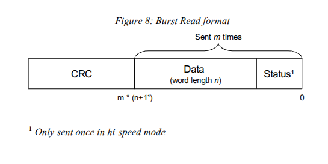
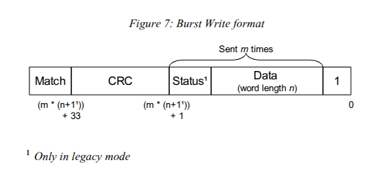

# Meeting Notes

No meeting

# Work Done

## added bus arbiter to the simulation

make sure the begin/end transaction signals sent on the bus are correct. until now the BIU only worked for non-error memory reads.

## in case of read error

|         | read   | write  |
|---------|--------|--------|
| error   | master | master |
| success | slave  | master |

for reads only, `end_transaction = sb_error`


## simulate burst dr-scan

what is the size of this dr-scan?
line 560 of `or1k_du_adv.c`:
```c
// [...]
// size  = word size in bytes (1, 2, 4)
// count = word count
int total_size_bytes = count * size;
// [...]
field.num_bits = (total_size_bytes + CRC_LEN + STATUS_BYTES) * 8;
```

in our testbench, we use the following command
```verilog
setup_burst(4'h7, 32'h0000_1000, 16'd1);
```
`count` is `1`
`size` is `4`
`STATUS_BYTES` is always `1`
`CRC_LEN` is always `4` (32-bit CRC)



We manually compute `field.num_bits = 72` bits. the burst read command is 72 bits long.

`0xDEAD_BEEF` is `0b1101_1110_1010_1101_1011_1110_1110_1111`
Read is LSB first, and the first bit is a status bit, so:


if the tb reads the tdo line and dumps its content into a register:
can read `DEADBEEF` inside `reg_tdo_out` !
```
0x0...0000_E5A5_9FE0_DEAD_BEEF
```

## support for writes


for writes, the FSM stays in the `TRANSFER` state for as long as the slave stays in the `busy` state. transfer ends, and `end_transaction` is asserted the first cycle after busy goes low.

burst setup command is very similar, only change opcode from `0x7` for a 32bit read to `0x3` for a 32bit write. the rest is the exact same

```c
/* Write a start bit so it knows when to start counting */
uint8_t value = 1;
field[0].num_bits = 1;
field[0].out_value = &value;
field[0].in_value = NULL;

uint32_t crc_calc = crc32_le(CRC32_POLY_LE, 0xffffffff, data,
        count * size);

field[1].num_bits = count * size * 8;
field[1].out_value = data;
field[1].in_value = NULL;

field[2].num_bits = 32;
field[2].out_value = (uint8_t *)&crc_calc;
field[2].in_value = NULL;

jtag_add_dr_scan(jtag_info->tap, 3, field, TAP_DRSHIFT);

/* Read the 'CRC match' bit, and go to idle */
field[0].num_bits = 1;
field[0].out_value = NULL;
field[0].in_value = &value;
jtag_add_dr_scan(jtag_info->tap, 1, field, TAP_IDLE);
```

the burst command is different
`1` status bit
`size` is still `4` because opcode is `0x3`
`count` is still `1`, we only transfer 1 32-bit word
```
1  bit  | status bit
32 bits | data
32 bits | crc
```



`dr_scan = 1 + 1 * 4 * 8 + 32 + 1 = 1 + 64 + 1 = 66`
burst write is 66 bits long.

---

# TODO

## problem with openOCD source code

i think openOCD only supports hi-speed mode. the DR-scans present in the code match hi-speed.
- for reads, there are 8 status bits at the beginning and the first non-0 status bit is followed by data. but in theory, in legacy mode, the number of status bits depend on the number of words read. this is not the case in openOCD source code.
- for writes, same problem - the number of status bits does not depend on the number of words read..... only one status bit at the beginning

to me, the source code matches exactly hi-speed mode. openOCD suggests it does support non hi-speed mode but the code does say otherwise. and there also seems to be checks for non hi-speed mode (aka legacy mode), but they seem to happen after the main dr scans.......

conclusion: I will edit the RTL code of adv_debug_if and synthetize it for hi-speed, I was hoping to use legacy mode for additional checks to make sure the system bus is sufficiently fast, but I guess i will not be able to do that.

## timing problem => combinatorial paths on grant signal

grant signal from bus arbiter is not latched. could this cause issue with our system bus? maybe not for reads, probably for writes.

because the bus is used on the same cycle as when we receive the grant signal

same when reading data when present on the bus, combinatorial path on `sb_address_data`....

based on previous slide, the busy signal only asserts the cycle after the begin transaction signal ====> the BIU is too fast

